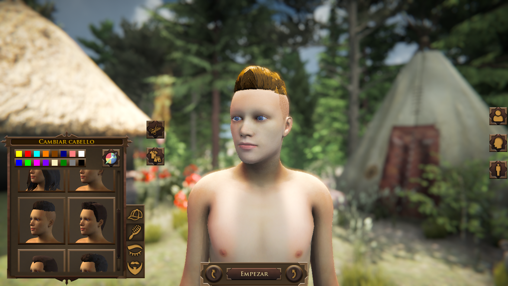
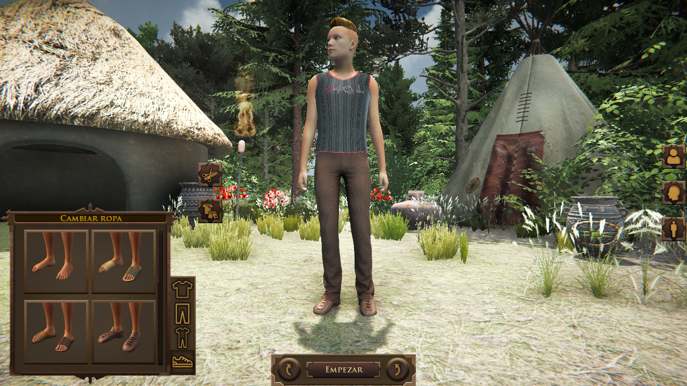
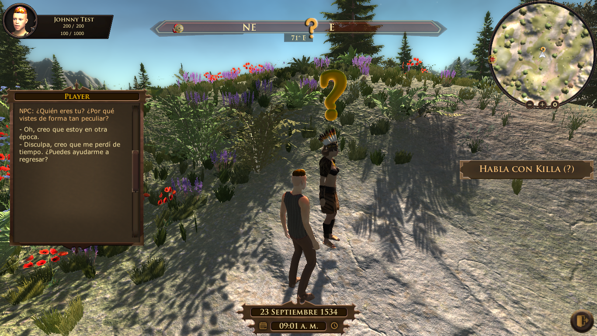
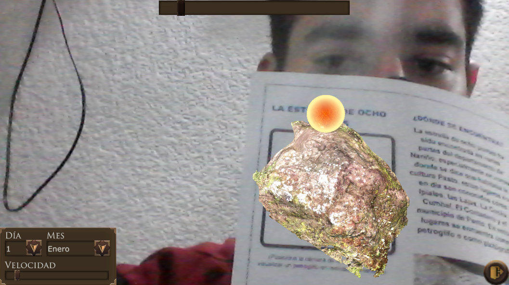
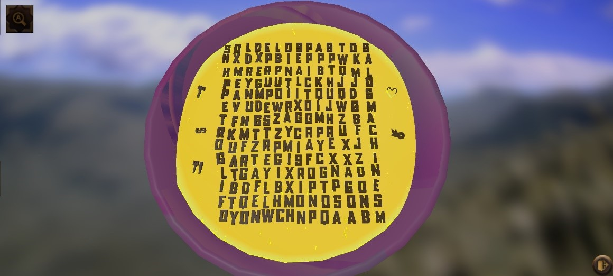
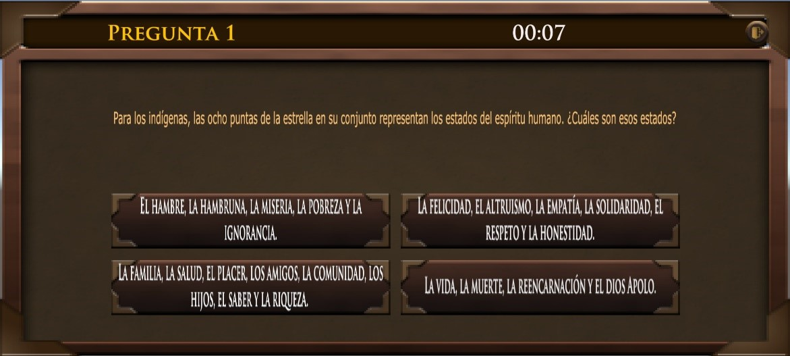

# Ch'aska Pakasqa
Juego de realidad virtual no inmersiva y app de realidad aumentada creada con el fin de salvaguardar el arte rupestre nariñense.
 
 
 
 
 

Módulo de creación de un personaje (PC).
 
 
 

Módulo de juego (PC).
 
 
 

Módulo de realidad aumentada (Android).
 
 
 

Módulo de actividades de aprendizaje (Android).
 
 
 

Módulo de cuestionario.
